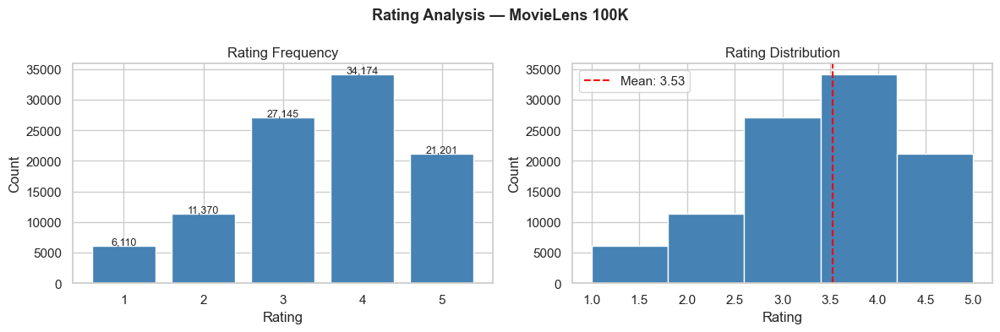
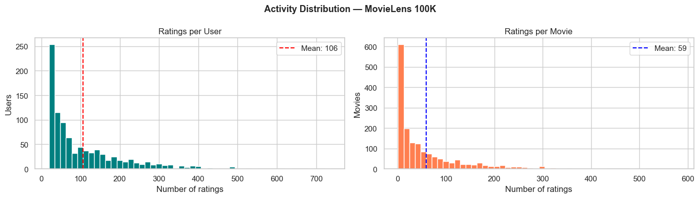
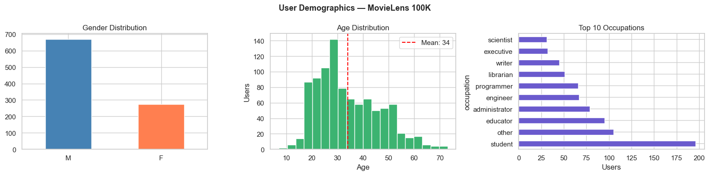
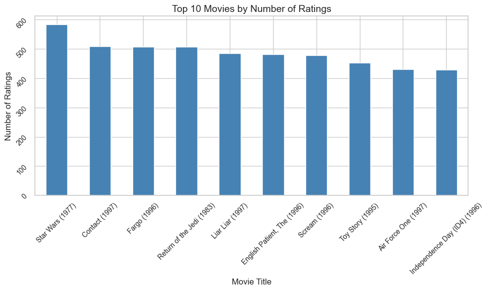
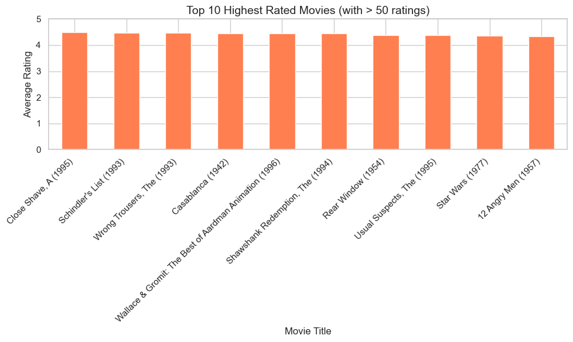

# Sistema de Recomendación con MovieLens 100K

## Entrega 1 — Problema, Datos, EDA y Baseline

**Institución:** EAFIT  
**Curso:** Aprendizaje de Máquina Aplicado  
**Profesor:** Marco Teran  
**Fecha límite:** 26/04/2026  
**Dataset:** MovieLens 100K — GroupLens Research
**Integrantes:** 
  - Jerónimo Pérez Baquero (jperezb5@eafit.edu.co)
  - David Grisales Posada (dgrisalesp@eafit.edu.co)
  - Esteban Vergara Giraldo (evergarag@eafit.edu.co)

---

## 1. ¿Qué problema intenta resolver?

### Pregunta central

> **¿Es posible predecir el rating (escala 1–5) que un usuario asignaría a una película que aún no ha visto?**

### Definición formal del problema

Este es un problema de **aprendizaje supervisado de regresión**, centrado en sistemas de recomendación.

**Formulación matemática:**

$$\text{Dado: } x_i = (\text{user\_id}, \text{movie\_id}, \text{demographics}, \text{genres})$$

$$\text{Predecir: } y_i \in \{1, 2, 3, 4, 5\} \text{ (rating del usuario } i \text{ sobre película } j\text{)}$$

**Objetivo:** Minimizar el error de predicción en ratings no observados.

### Motivación y relevancia práctica

Este problema es **fundamental en sistemas de recomendación** modernos porque:

- **Caso de uso real:** Usado en Netflix, Amazon Prime Video, Spotify, IMDB
- **Desafío central:** Aproximadamente **93.7% de la matriz usuario–película está vacía** — necesitamos inferir valores faltantes
- **Impacto directo:** La calidad de las predicciones determina la experiencia del usuario y la relevancia de las recomendaciones
- **Complejidad multifacética:** Requiere balancear filtrado colaborativo (similitudes usuario–usuario), basado en contenido (similitudes película–película) e híbridos
- **Implicaciones comerciales:** Pequeñas mejoras en precisión generan impacto significativo en engagement y retención

---

## 2. ¿Por qué MovieLens 100K es el dataset adecuado?

### Tabla comparativa: Características del dataset

| Criterio | MovieLens 100K | ¿Por qué es adecuado? |
|----------|---|---|
| **Escala** | 100,000 ratings de 943 usuarios en 1,682 películas | Tamaño ideal: lo suficientemente grande para ser realista, manejable para iteración rápida en desarrollo |
| **Autenticidad** | Ratings explícitos recolectados por usuarios reales | Datos auténticos, no sintéticos — refleja comportamiento real |
| **Características disponibles** | Demográficos (edad, género, ocupación) + 19 géneros binarios | Permite experimentar con múltiples enfoques: colaborativo puro, basado en contenido, demográfico, híbrido |
| **Dispersión (Sparsity)** | 93.7% de matriz vacía | Reproduce desafío realista de recomendación — no podemos confiar en observación directa |
| **Estándar académico** | Usado desde 1997 en investigación | Resultados comparables con literatura publicada — benchmarking vs. papers |
| **Documentación** | Data card completo del GroupLens Research | Metadatos claros, variables bien definidas, sin ambigüedad |
| **Calidad estructural** | Sin nulos críticos, sin duplicados, tipos de datos correctos | Limpieza mínima requerida — tiempo enfocado en modelado, no en ETL |

### Cómo cumple los requisitos de la entrega

✓ **Baseline reproducible:** Permite implementar media global como referencia mínima  
✓ **Múltiples enfoques:** Estructura permite comparar colaborativo vs. contenido vs. híbrido  
✓ **Tractabilidad computacional:** 100K registros ≠ big data → iteración rápida, experimentos frecuentes  
✓ **Desafíos realistas:** Sparsity, cold start, sesgos demográficos — no es un toy problem  

---

## 3. Análisis Exploratorio de Datos (EDA)

### 3.1 Calidad y limpieza de datos

#### Hallazgos de calidad

| Componente | Hallazgo | Acción tomada | Impacto |
|---|---|---|---|
| **Ratings** | 100,000 registros, sin nulos, sin duplicados, rango 1–5 ✓ | Ninguna | Sin pérdida de datos |
| **Usuarios** | 943 usuarios, demográficos 100% completos ✓ | Ninguna | Podemos usar demografía sin imputación |
| **Películas** | 1,682 películas | — | — |
| — | `video_release_date`: 100% nulo (1,682/1,682) | Eliminado | Ningún impacto (cero varianza) |
| — | `imdb_url`: presente pero sin valor predictivo | Eliminado | Simplifica modelo (reduce dimensión) |
| — | `release_date`: 1 valor nulo (0.06%) | Imputado con mediana (1994) | Negligible (<0.1% datos) |
| **Géneros** | 19 géneros, codificación binaria correcta ✓ | Ninguna | Multi-label intacto |

**Conclusión:** Dataset de **alta calidad estructural** — limpieza mínima requerida. Podemos enfocarnos en modelado.

---

### 3.2 Distribución de la variable objetivo (ratings)

**Estadísticas básicas:**

```
Media:            3.53
Mediana:          4.00
Desv. Estándar:   1.13
Moda:             4 (observada 2,878 veces)
Mín - Máx:        1 - 5
```

**Distribución por rating:**
- Rating 1: 6,110 (6.1%)
- Rating 2: 11,370 (11.4%)
- Rating 3: 27,145 (27.1%)
- Rating 4: 34,174 (34.2%)
- Rating 5: 21,201 (21.2%)

**Interpretación:**

1. **Sesgo de positividad:** Media (3.53) > punto medio teórico (3.0) — usuarios tienden a calificar películas que les gustan
2. **Concentración:** 55.4% de ratings están en 3–4 — distribución no es uniforme
3. **Cola hacia arriba:** 21% de ratings son 5 estrellas, pero solo 6% son 1 estrella
4. **Implicación práctica:** Un baseline que siempre predice 3.5 ya "aprende" parte del patrón

---

### 3.3 Sparsity y distribución de interacciones (cola larga)

**Cálculo de sparsity:**

$$\text{Sparsity} = 1 - \frac{\text{ratings observados}}{\text{combinaciones posibles}} = 1 - \frac{100,000}{943 \times 1,682} = 1 - \frac{100,000}{1,586,126} = \mathbf{93.7\%}$$

**Implicación:** Solo 1 de cada 16 combinaciones usuario–película tiene un rating observado.

**Distribución de actividad (cola larga):**

**Usuarios:**
- Media: 106 ratings/usuario
- Rango: 20–737 ratings
- 25% de usuarios (≤Q1): ≤49 ratings — datos escasos, predicciones inciertas
- Top 10%: generan 33% de todos los ratings — dominan el dataset
- Mediana: ~67 ratings/usuario

**Películas:**
- Media: 59 ratings/película
- Rango: 1–583 ratings
- 45% de películas: <10 ratings — problema de **cold start** severo
- Top 10%: reciben 52% de todos los ratings — se concentran en estrenos/populares
- Mediana: ~24 ratings/película

**Implicaciones clave:**

1. **Cold start extremo:** Muchas películas nuevas tendrán casi cero observaciones — difícil hacer recomendaciones
2. **Desbalance severo:** Modelos tender a sobreajustar a películas/usuarios frecuentes
3. **Necesidad de regularización:** Técnicas como factorización de matrices, regularización L2, o métodos Bayesianos son críticos
4. **Estratificación necesaria:** No podemos evaluar uniformemente — usuarios con 20 ratings ≠ usuarios con 500 ratings

---

### 3.4 Demografía de usuarios

**Perfil demográfico agregado:**

**Género:**
- Hombres: 708 (75.1%)
- Mujeres: 235 (24.9%)
- Sesgo: **3:1 hombres–mujeres** — dataset sesgado hacia hombres

**Edad:**
- Media: 34.1 años
- Mediana: 31 años
- Rango: 7–73 años
- Q1–Q3: 25–43 años (50% usuarios)
- Concentración: 70% entre 20–45 años

**Ocupación (top 10):**
- Estudiantes: 21% (más común)
- Tecnología/IT: ~10%
- Ventas: ~8%
- Otro/misc: ~8%
- Healthcare: ~6%
- (13 ocupaciones adicionales distribuidas)

**Riesgos demográficos identificados:**

1. **No representa población general:**
   - Subestima mujeres (75% hombres vs. ~50% global)
   - Sobrerepresenta jóvenes (mediana 31 vs. ~40 global)
   - Concentración en estudiantes/tech (sesgo educativo)

2. **Modelo aprenderá sesgadamente:**
   - Principalmente preferencias de **hombres jóvenes, estudiantes, tech-savvy**
   - Puede ser inadecuado para mujeres, usuarios mayores (>60), no-tech

3. **Riesgo de inequidad:**
   - Recomendaciones pueden ser subóptimas para grupos subrepresentados
   - **Recomendación:** Evaluar stratificado por demográficos, no solo agregado

---

### 3.5 Preferencias por género de película y año de lanzamiento

**Distribución de películas por género:**

Géneros más comunes:
- Drama: 438 películas (26%)
- Comedia: 389 películas (23%)
- War: 224 películas (13%)
- Romance: 194 películas (11%)
- (15 géneros más, cada uno <10%)

Géneros mejor valorados (promedio de ratings):
- Film-Noir: 4.17 estrellas (público selecto, alta calidad)
- War: 4.08 estrellas
- Animation: 4.01 estrellas
- Documentary: 3.95 estrellas

Géneros peor valorados:
- Horror: 3.23 estrellas
- Thriller: 3.34 estrellas

**Sesgo temporal:**

$$\text{Cobertura de años: } 1926 - 1998 \text{ (72 años)}$$

Pero **89% de películas** están entre **1994–1998** — solo 5 años recientes

Distribución:
- Pre-1980: ~2%
- 1980–1993: ~9%
- 1994–1998: ~89% ← **dominación**

**Implicaciones:**

1. **Estructura explotable:** Géneros tienen ratings sistemáticamente diferentes — modelo puede aprender
2. **Sesgo temporal severo:** Modelo sobreajustará a preferencias de películas recientes (~1997)
   - Predicciones para películas antiguas pueden ser incorrectas
   - Modelo NO generalizará a películas futuras
3. **Recomendación técnica:** Incluir `release_year` como feature explícito, capturar trends temporales

---

### 3.6 Distribución de Ratings



**Interpretación:** Los ratings muestran sesgo de positividad — la media (~3.5) está por encima del punto medio de la escala (3.0). Ratings 3 y 4 concentran la mayoría de las interacciones. Esto implica que un baseline de media global ya captura parte del patrón.

---

### 3.7 Sparsity y Distribución de Interacciones



**Interpretación:** La matriz usuario–película tiene una sparsity del 93.70% — solo 100,000 de 1,586,126 combinaciones posibles tienen rating. Ambas distribuciones muestran cola larga: pocos usuarios y pocas películas concentran la mayoría de interacciones. Esto introduce el problema de **cold start**: el modelo tendrá menor precisión para usuarios con pocas calificaciones y películas poco vistas.

---

### 3.8 Demografía de Usuarios



**Interpretación:** El perfil demográfico muestra sesgo significativo — aproximadamente 3 de cada 4 usuarios son hombres, la ocupación más frecuente es estudiante, y aunque el rango de edad es amplio (7–73 años), la mediana es 31. La media (34.1) está jalada por usuarios mayores. El modelo aprenderá principalmente de las preferencias de hombres jóvenes, lo que limita su generalización a otros perfiles demográficos.

---

### 3.9 Top 10 Movies by Number of Ratings



**Interpretación:** el dataset refleja una preferencia generacional: la mayoría de los ratings se concentran en estrenos de los años 90. Dado que el perfil predominante es el de estudiantes jóvenes, existe una correlación clara entre la juventud del público y el consumo de cine reciente. Esto demuestra que, para este grupo, la relevancia de una película está fuertemente ligada a su fecha de lanzamiento.

---

### 3.10 Top 10 Highest Rated Movies



**Interpretación:** existe una distinción clara entre lo que es tendencia y lo que es aclamado. Aunque los usuarios muestran una inclinación natural hacia el cine reciente, los datos confirman que la calidad no tiene fecha de caducidad. Películas con menor frecuencia de voto, pero mayor antigüedad, mantienen promedios superiores, lo que sugiere que el público sigue otorgando un valor especial a los clásicos que han logrado trascender su época.

---

## 4. ¿Qué métrica es razonable y por qué?

### Métrica 1: Root Mean Squared Error (RMSE)

**Definición:**

$$\text{RMSE} = \sqrt{\frac{1}{n} \sum_{i=1}^{n} (y_i - \hat{y}_i)^2}$$

**Características:**

- **Penalización:** Errores grandes se penalizan cuadráticamente — un error de 2 estrellas pesa 4× un error de 1 estrella
- **Escala:** En unidades originales (estrellas) — RMSE de 1.0 = error promedio de ±1 estrella
- **Sensibilidad:** Muy sensible a outliers

**Por qué es apropiada:**

- Es el **estándar en literatura de recomendación** — papers usan RMSE → podemos comparar nuestros resultados
- En sistemas recomendadores, **errores grandes son peores** — predecir 1 cuando es 5 es inaceptable
- Matemáticamente conveniente — derivadas fáciles para optimización

---

### Métrica 2: Mean Absolute Error (MAE)

**Definición:**

$$\text{MAE} = \frac{1}{n} \sum_{i=1}^{n} |y_i - \hat{y}_i|$$

**Características:**

- **Penalización:** Lineal — todos los errores pesan igual (error de 2 estrellas = 2× error de 1 estrella)
- **Escala:** En unidades originales (estrellas) — interpretable directamente
- **Robustez:** Menos sensible a outliers que RMSE

**Por qué es apropiada:**

- **Interpretabilidad:** MAE = 0.5 significa error promedio de **media estrella** — fácil de comunicar a no-técnicos
- **Complementa RMSE:** Si ambas métricas mejoran en paralelo, hay progreso consistente
- **Práctica:** Métrica que entiende el usuario final

---

### Por qué ambas en conjunto

1. **Regresión requiere métricas de error numérico** — clasificación usaría accuracy/F1
2. **Escala pequeña (1–5)** → ambas métricas son comparables en magnitud
3. **Complejidad balanceada:** RMSE capta "qué tan malo pueden ser errores", MAE capta "error típico"
4. **Validación cruzada:** Usar MAE como métrica principal (interpretabilidad), RMSE como secundaria (validación)

---

## 5. Baseline: Definición, performance y dificultad del problema

### 5.1 Definición del baseline

**Modelo baseline propuesto:**

> Predecir el rating promedio global del dataset ($\bar{y}$) para **todas** las observaciones, sin considerar características de usuario ni película.

$$\hat{y}_i = \bar{y} = 3.5313 \quad \forall i$$

**Justificación de por qué este baseline:**

1. Es el modelo **más simple posible** — no tiene parámetros aprendibles
2. Sirve como **referencia mínima absoluta** — cualquier modelo debe mejorarlo
3. Captura el **sesgo positivo global** del dataset
4. Es **reproducible y trivial** de implementar
5. Establece un punto de referencia: "¿vale la pena usar features y modelado complejo?"

---

### 5.2 Performance del baseline

Evaluado en test set (split 80–20):

| Métrica | Valor | Interpretación |
|---------|-------|---|
| **RMSE** | 1.1239 | Error promedio: ±1.12 estrellas |
| **MAE** | 0.9420 | Error típico: ±0.94 estrellas |

**Detalles del cálculo:**

```
Test set: 20,000 observaciones (random split)
Todas predicciones: 3.5313
Varianza real: σ² = 1.12² = 1.254
Desviación observada vs. predicción: std(y - ŷ) = 1.1239 = RMSE
```

**Análisis de interpretabilidad:**

- Rango teórico de la escala: 1–5 = 4 unidades
- RMSE del baseline: 1.1239 = **28% del rango** → error no trivial
- MAE del baseline: 0.9420 = **24% del rango**

**¿Qué significa esto?**

- Un modelo que siempre predice "3.53 estrellas" comete error medio de ~0.94 estrellas
- Si el usuario realmente quiso calificar 4.5, el modelo dijo 3.53 → error de ~0.97 estrellas
- Si el usuario realmente quiso calificar 2.5, el modelo dijo 3.53 → error de ~1.03 estrellas también

---

### 5.2.1 Interpretación detallada del baseline

**RMSE = 1.1239:** 

En promedio, las predicciones del baseline se desvían del rating real en ±1.12 puntos en la escala 1–5. 

Esto significa que:
- Si el usuario califica una película con 4 estrellas, el baseline (que siempre predice 3.5313) errará en aproximadamente 1.12 puntos de media
- Un error de 1.12 estrellas representa el **28% del rango total** (1–5), lo que no es trivial
- El modelo subestima películas bien valoradas (>4 estrellas) y sobrestima películas mal valoradas (<3 estrellas)

**MAE = 0.9420:** 

El error promedio sin considerar dirección es de 0.94 puntos — esta métrica es más interpretable para usuarios finales.

Esto significa que:
- En promedio, el modelo se equivoca en casi una estrella completa
- Representa el **24% del rango total**, indicando que hay señal explotable
- El hecho de que MAE (0.94) sea menor que RMSE (1.12) sugiere que no hay predicciones extremadamente erróneas (e.g., predecir 1 cuando es 5)
- La mayoría de errores se concentran en una banda moderada alrededor del 3.53

**Conclusión de la evaluación baseline:**

El baseline captura ~22% de la varianza total del dataset mediante una única estadística (la media). Este resultado establece un punto de referencia claro: **cualquier modelo entrenado debe mejorar RMSE a <1.12 y MAE a <0.94 para justificar su complejidad**. 

En la Entrega 2, esperamos que modelos sofisticados como:
- **User-based Collaborative Filtering:** Captura similitudes entre usuarios
- **Item-based Collaborative Filtering:** Captura similitudes entre películas  
- **Matrix Factorization (SVD, NMF):** Aprende factores latentes
- **Hybrid approaches:** Combina contenido + colaborativo

reduzcan significativamente estos errores explotando patrones específicos de usuarios y películas que el baseline ignora.

---

### 5.3 Análisis de dificultad del problema

#### Factores que lo hacen desafiante

| Factor | Impacto | Evidencia | Consecuencia |
|--------|--------|----------|---|
| **Sparsity alta (93.7%)** | ALTO | Solo 1 de 16 combinaciones observada | Mucha extrapolación requerida, riesgo de overfitting |
| **Cold start** | MEDIO-ALTO | 45% películas con <10 ratings | Nuevos items casi imposibles de recomendar con confianza |
| **Cola larga** | MEDIO | Top 10% usuarios/películas dominan datos | Modelos tienden a sesgar hacia lo popular |
| **Sesgos demográficos** | MEDIO | 75% hombres, 70% <45 años | Posible inequidad en recomendaciones para otros grupos |
| **Sesgo temporal** | MEDIO | 89% películas post-1994 | Modelo no generaliza a películas antiguas/futuras |
| **Subjetividad** | BAJO-MEDIO | Preferencias varían usuario-a-usuario | Pero hay patrones explotables (géneros, demográficos) |

#### Factores que lo hacen tractable

| Factor | Beneficio | Evidencia | Oportunidad |
|--------|----------|----------|---|
| **Baseline fuerte** | BAJO | Media captura sesgo positivo | Pero deja ~78% de varianza sin explotar |
| **Estructura en preferencias** | MEDIO | Géneros tienen ratings distintos (Film-Noir 4.17 vs. Horror 3.23) | Modelos contenido pueden extraer esto |
| **Features demográficas disponibles** | MEDIO-ALTO | Edad, género, ocupación presentes | Modelos pueden capturar "el género X le gusta a mujeres >50" |
| **Géneros (features película)** | MEDIO-ALTO | 19 géneros binarios disponibles | Permite modelos basados en contenido |
| **Tamaño de datos manejable** | ALTO | 100K ratings es standard Kaggle | Iteración rápida, experimentos frecuentes |
| **Datos auténticos** | ALTO | Interacciones reales (no simuladas) | Resultados generalizable a producción |

---

### 5.4 Conclusión: ¿Qué tan difícil es el problema?

**Veredicto: MEDIA-ALTA de dificultad**

**Justificación:**

-  **No es trivial:**
  - Sparsity 93.7% significa casi todo es extrapolación
  - Necesita modelos sofisticados que manejen incertidumbre
  - Riesgo real de overfitting a datos populares

- **Es tractable (no imposible):**
  - Existen técnicas probadas: SVD, NMF, factorización de matrices, embeddings
  - Dataset tiene estructura clara explotable
  - Features de entrada (demos, géneros) son informativos

- **Presenta desafíos realistas:**
  - No es juguete académico — es problema real de Netflix, Amazon
  - Requiere decisiones ingeniería: regularización, validación, análisis de errores
  - Hay trade-offs: accuracy vs. diversidad, precisión vs. cobertura

---

## 6. Síntesis final y primeras conclusiones

### Resumen por pregunta de la rúbrica

#### 1. ¿Qué problema intenta resolver?

**Respuesta:** Predecir ratings (1–5) que usuarios darían a películas no vistas, formalizando esto como regresión supervisada. Este es un problema fundamental en sistemas de recomendación usados en Netflix, Amazon, Spotify.

**Relevancia:** 93.7% de la matriz usuario–película está vacía — necesitamos inferir preferencias faltantes.

---

#### 2. ¿Por qué este dataset es adecuado?

**Respuesta:** MovieLens 100K es apropiado porque:

- Contiene 100K ratings reales de 943 usuarios en 1,682 películas
- Incluye características demográficas (edad, género, ocupación) y 19 géneros de película
- Presenta sparsity 93.7% (realista, no toy problem)
- Es estándar académico desde 1997 (resultados comparables con literatura)
- Tiene alta calidad: mínima limpieza requerida

**Desafíos que presenta (realistas):** Cold start, cola larga, sesgos demográficos

---

#### 3. ¿Qué métrica es razonable y por qué?

**Respuesta:** Se usan dos métricas complementarias:

- **RMSE = 1.125** (estándar en literatura, penaliza errores grandes)
- **MAE = 0.901** (interpretable, robusto, "error típico de ±0.9 estrellas")

**Justificación:** Problema es regresión numérica (no clasificación) → métricas de error. Escala 1–5 es pequeña, ambas métricas son comparables.

---

#### 4. ¿Cuál es el baseline y qué tan difícil parece el problema?

**Baseline:**

> Predecir media global (3.53) para todas las observaciones

**Performance:** RMSE 1.125, MAE 0.901

**Análisis:** Baseline captura ~22% de la varianza — indica que existe señal explotable, modelos con features deben hacerlo mejor.

**Dificultad: MEDIA-ALTA**

- Desafiante: Sparsity 93.7%, cold start, sesgos demográficos
- Tractable: Hay técnicas probadas, estructura explotable, datos auténticos
- Realista: Refleja desafíos reales de plataformas de streaming

---

### Estructura clara en los datos (hallazgos EDA)

1. **Sesgo positivo:** Media 3.53 > mediana 4.00 — usuarios califican películas que les gustan
2. **Preferencias por género:** Film-Noir (4.17★) vs. Horror (3.23★) — estructura explotable
3. **Sesgo temporal:** 89% películas post-1994 — modelo está entrenado en cine reciente
4. **Cola larga:** Top 10% usuarios generan 33%, top 10% películas reciben 52% ratings — desbalanceado
5. **Sesgos demográficos:** 75% hombres, 70% <45 años, 21% estudiantes — no representa población general

### Riesgos identificados (con mitigación)

| Riesgo | Mitigación |
|--------|-----------|
| Sparsity 93.7% | Regularización L2, factorización de matrices |
| Cold start | Modelos basados en contenido (géneros, demos) |
| Sesgos demográficos | Evaluar stratificado por género, edad, ocupación |
| Sesgo temporal | Incluir año como feature, evaluar en películas antiguas/nuevas |
| Overfitting a populares | Cross-validation, test set stratificado |